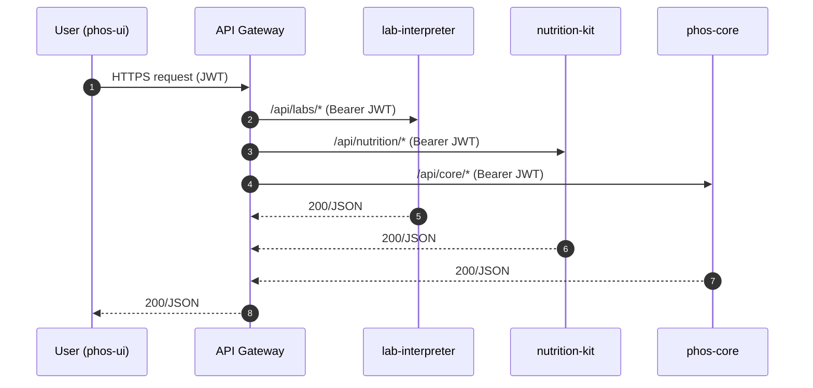
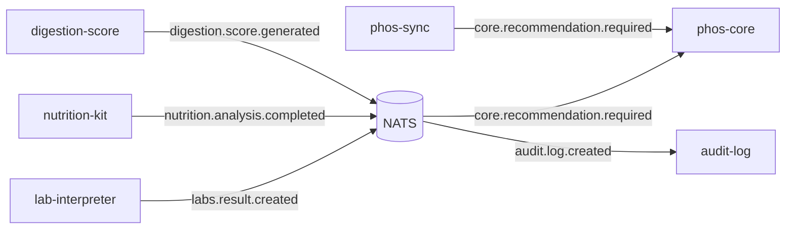
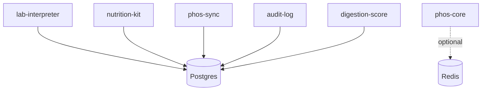

# PHOS Architecture

## Request Flow (UI → Gateway → Services)

```mermaid
sequenceDiagram
  autonumber
  participant U as User (phos-ui)
  participant G as API Gateway
  participant S1 as lab-interpreter
  participant S2 as nutrition-kit
  participant C as phos-core

  U->>G: HTTPS request (JWT)
  G->>S1: /api/labs/* (Bearer JWT)
  G->>S2: /api/nutrition/* (Bearer JWT)
  G->>C: /api/core/* (Bearer JWT)
  S1-->>G: 200/JSON
  S2-->>G: 200/JSON
  C-->>G: 200/JSON
  G-->>U: 200/JSON
```

## Event Flow (NATS topics)

```mermaid
flowchart LR
  LI[lab-interpreter] -- labs.result.created --> NATS[(NATS)]
  NK[nutrition-kit] -- nutrition.analysis.completed --> NATS
  NATS -- core.recommendation.required --> CORE[phos-core]
  SYNC[phos-sync] -- core.recommendation.required --> CORE
  NATS -- audit.log.created --> AUD[audit-log]
  DS[digestion-score] -- digestion.score.generated --> NATS
```

## Data Stores

```mermaid
graph TD
  PG[(Postgres)]
  R[(Redis)]
  LI[lab-interpreter] --> PG
  NK[nutrition-kit] --> PG
  SYNC[phos-sync] --> PG
  AUD[audit-log] --> PG
  DS[digestion-score] --> PG
  CORE[phos-core] -. optional .-> R
```
